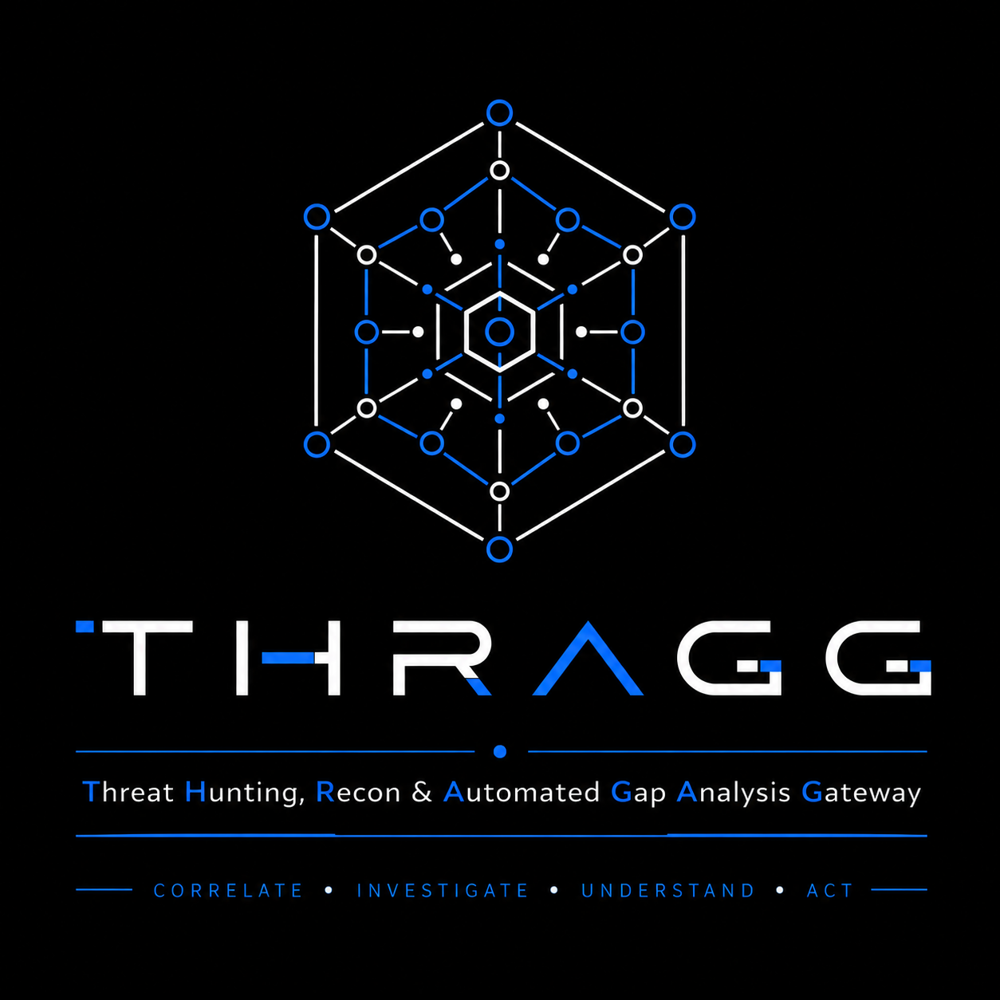
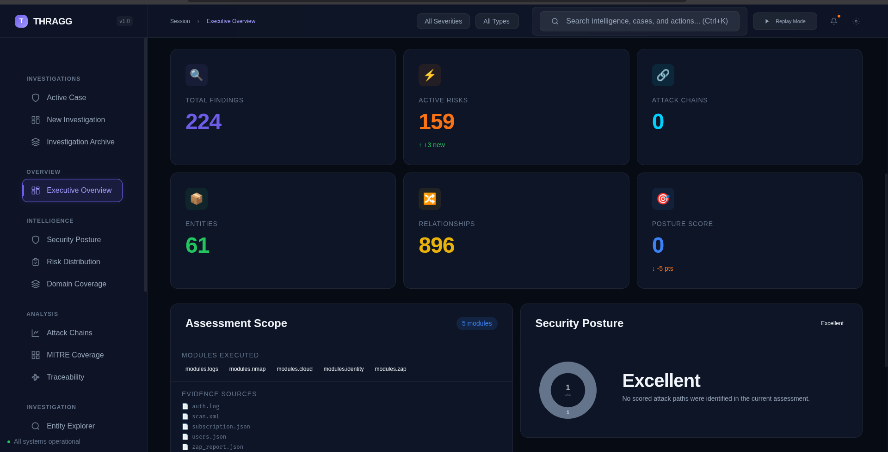
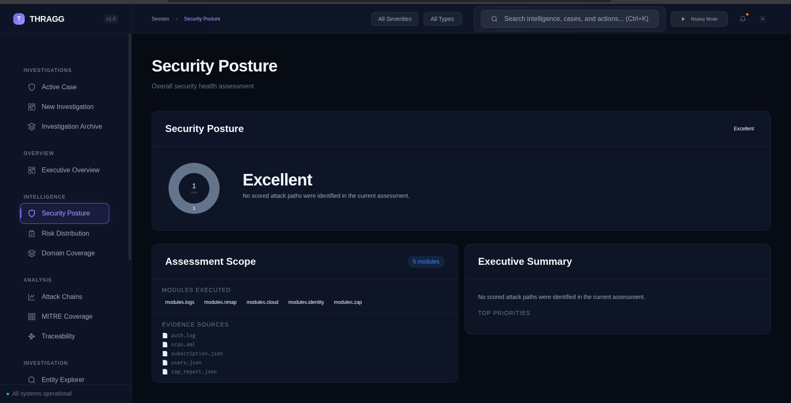
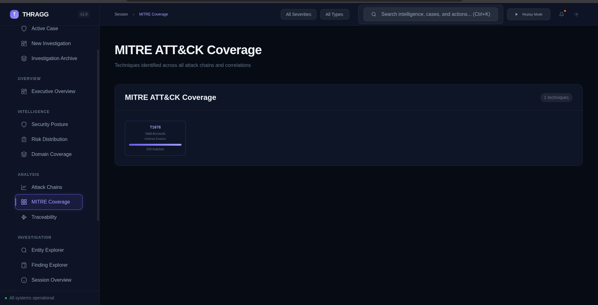
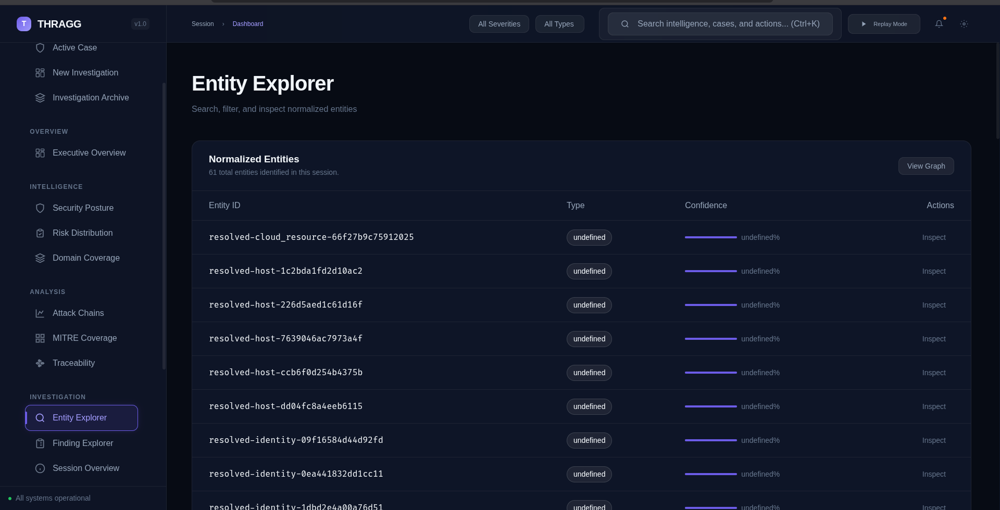
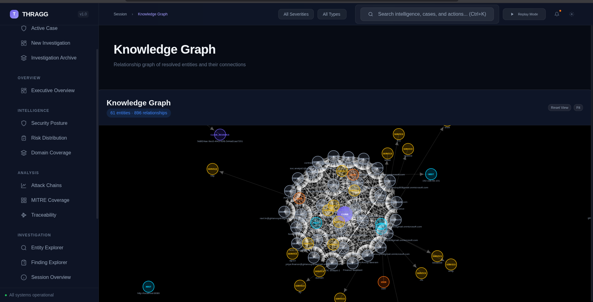
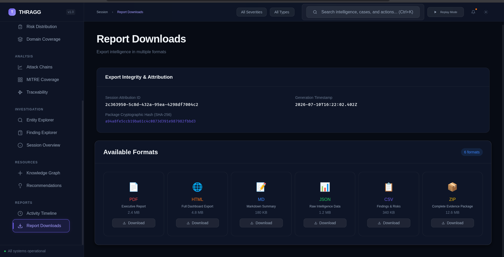
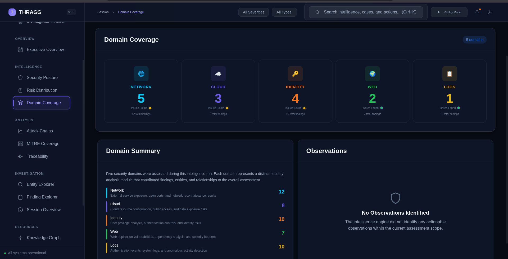
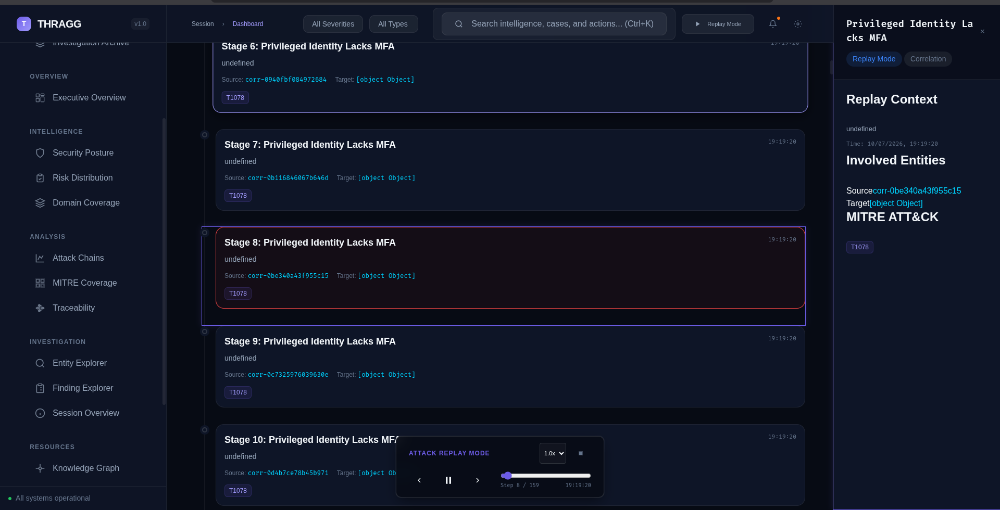

<div align="center">

# THRAGG

### Threat Hunting, Recon & Automated Gap Analysis Gateway

**Enterprise Cybersecurity Investigation Platform**

*Correlate • Investigate • Understand • Act*


> **Every alert tells a story. THRAGG reconstructs it.**

</div>

---

<div align="center">



# THRAGG

### Threat Hunting, Recon & Automated Gap Analysis Gateway

**Enterprise Cybersecurity Investigation Platform**

*Correlate • Investigate • Understand • Act*

</div>

---

# Overview

THRAGG (**Threat Hunting, Recon & Automated Gap Analysis Gateway**) is an enterprise-inspired cybersecurity investigation platform that consolidates fragmented security intelligence into a single analyst-centric workspace.

Instead of treating findings as isolated events, THRAGG reconstructs relationships between entities, correlates intelligence across multiple security domains, visualizes attack progression, enables interactive replay of incidents, and produces executive-ready investigation reports.

The platform is designed around real Security Operations Center (SOC) workflows, allowing analysts to move seamlessly from detection to investigation, correlation, reporting, and decision-making through a modular, offline-first architecture.

---

# Why THRAGG?

Modern investigations often require analysts to switch between numerous security tools before understanding a single incident.

THRAGG eliminates this fragmentation by providing a unified investigation platform capable of:

- Correlating findings across multiple security domains
- Visualizing relationships between infrastructure and findings
- Reconstructing complete attack chains
- Mapping activity to MITRE ATT&CK
- Replaying incidents chronologically
- Managing investigations through a dedicated case workspace
- Generating executive-ready incident reports

---

# Core Features

## Intelligence Analysis

- Interactive Knowledge Graph
- Attack Chain Reconstruction
- Entity Resolution
- Finding Correlation
- Relationship Visualization
- Timeline Analysis

## Investigation Workspace

- Case Management
- Analyst Notes
- Investigation Bookmarks
- Context Panel
- Session Overview

## Threat Intelligence

- MITRE ATT&CK Coverage
- Risk Distribution
- Security Posture Analysis
- Domain Coverage
- Recommendations Engine

## Investigation Replay

- Interactive Replay Engine
- Timeline Scrubbing
- Replay Controls
- Attack Stage Navigation
- Context Synchronization

## Executive Reporting

- Executive Report Builder
- Report Composer
- Report Preview
- HTML Export
- Markdown Export
- JSON Export
- TXT Export

## Analyst Productivity

- Global Intelligence Search - Command Palette - Keyboard Shortcuts - Global Filters - Offline First Operation

---

# Platform Architecture

```
                  Security Modules
 ┌────────────┬────────────┬────────────┬────────────┐
 │CyberRecon  │Sentinel    │AegisGovern │VulnScope   │
 │Lab         │Forge       │            │            │
 └─────┬──────┴─────┬──────┴─────┬──────┴─────┬──────┘
       │            │            │            │
       └────────────┴────────────┴────────────┘
                        │
                 Intelligence Core
                        │
                 Entity Resolution
                        │
                  Relationship Engine
                        │
                 Correlation Engine
                        │
                 Attack Chain Builder
                        │
                Knowledge Graph Engine
                        │
                 Replay Engine
                        │
                Investigation Workspace
                        │
               Executive Report Builder
```

---

# Dashboard Modules

| Module | Purpose |
|---------|---------|
| Executive Overview | Investigation dashboard |
| Security Posture | Overall security assessment |
| Risk Distribution | Risk visualization |
| Domain Coverage | Security domain analysis |
| Knowledge Graph | Interactive entity relationships |
| Attack Chains | Chronological attack reconstruction |
| MITRE Coverage | ATT&CK technique mapping |
| Traceability | Evidence traceability |
| Entity Explorer | Entity investigation |
| Finding Explorer | Finding analysis |
| Activity Timeline | Investigation timeline |
| Recommendations | Remediation guidance |
| Case Workspace | Investigation management |
| Replay Engine | Interactive attack replay |
| Report Builder | Executive reporting |
| Command Palette | Global intelligence search |

---

# Technical Highlights

- Modular component architecture
- EventBus-driven communication
- Offline-first operation
- Interactive SVG Knowledge Graph
- Custom force-directed graph physics engine
- Replay state machine
- Unified intelligence indexing
- Immutable investigation model
- Enterprise report generation
- Responsive dashboard architecture

---

# Technology Stack

### Frontend

- JavaScript (ES6)
- HTML5
- CSS3
- SVG

### Architecture

- Component-Based Design
- EventBus Architecture
- Custom Graph Physics
- Replay State Machine
- Local Storage
- Offline-First Design

---

# Project Structure

# Project Structure

```text
THRAGG/
├── assets/                 # Branding, logos, screenshots
├── core/                   # Intelligence processing engine
│   ├── foundation/         # Findings, entities, relationships
│   ├── correlation/        # Correlation engine
│   ├── attack_chain/       # Attack chain reconstruction
│   ├── executive/          # Executive assessment engine
│   ├── dashboard/          # Dashboard generation
│   ├── reporting/          # Report generation
│   ├── risk/               # Risk scoring engine
│   └── shared/             # Shared utilities
│
├── modules/               # Security data collectors
├── frontend/              # Analyst dashboard
├── web/                   # Web server
├── tests/                 # Unit & integration tests
├── docs/                  # Technical documentation
├── data/                  # Sample datasets
├── sample_evidence/       # Demonstration evidence
├── static_findings/       # Static module outputs
├── rules/                 # Detection rules
├── schemas/               # Validation schemas
├── tools/                 # Development utilities
│
├── thragg.py              # Main application entry point
├── requirements.txt
└── README.md
```

---

# Installation

Clone the repository:

```bash
git clone https://github.com/anoop-808/THRAGG.git
```

Navigate into the project:

```bash
cd THRAGG
```

Start the local server (example):

```bash
python app.py
```

or

```bash
python server.py
```

depending on your local setup.

---

# Roadmap

## Completed (v4.0)

- Interactive Knowledge Graph
- Attack Replay Engine
- Case Workspace
- Context Panel
- Command Palette
- Global Intelligence Search
- MITRE Coverage
- Executive Report Builder
- Investigation Timeline
- Report Export Pipeline

## Future

- STIX/TAXII Support
- Sigma Rule Integration
- IOC Import
- Threat Feed Integration
- SIEM Connectors
- Multi-user Collaboration
- PDF Export
- AI-assisted Investigation

---

# Screenshots

## Executive Overview



---

## Security Posture



---

## MITRE ATT&CK Coverage



---

## Entity Explorer



---

## Knowledge Graph



---

## Report Downloads



---

## Domain Coverage



---

## Attack Replay Engine



---

# Project Vision

THRAGG was built to demonstrate how modern Security Operations Center (SOC) investigations can be unified into a single analyst-focused platform.

Rather than replacing existing security tools, THRAGG integrates intelligence across multiple security domains to provide contextual awareness, attack reconstruction, investigation replay, and executive reporting.

The long-term vision is to evolve THRAGG into a modular investigation platform capable of supporting enterprise threat hunting, incident response, and cyber defense workflows.

---

# License

Released under the MIT License.

---

# Author

## B. Giri Anoop

Computer Science & Cybersecurity Undergraduate

Focused on:

- Security Operations Center (SOC)
- Threat Hunting
- Detection Engineering
- Cloud Security
- Defensive Engineering
- Incident Response
